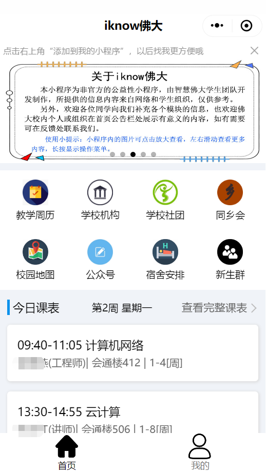
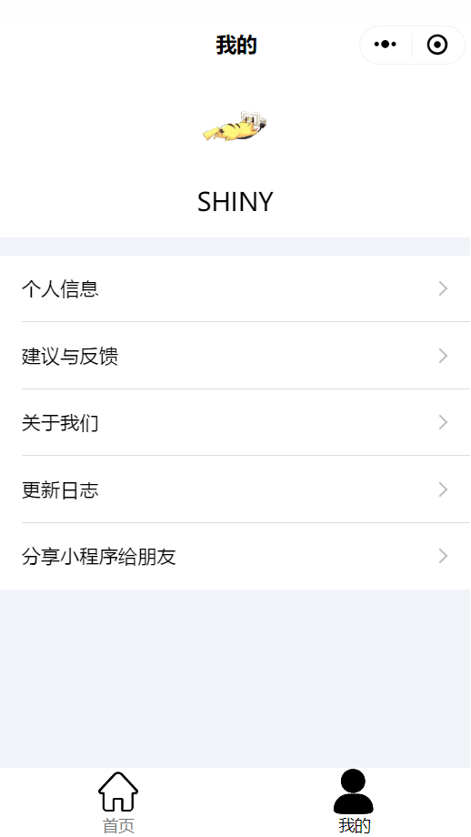
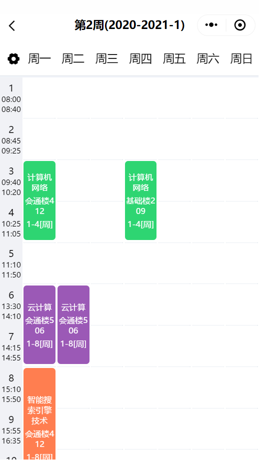
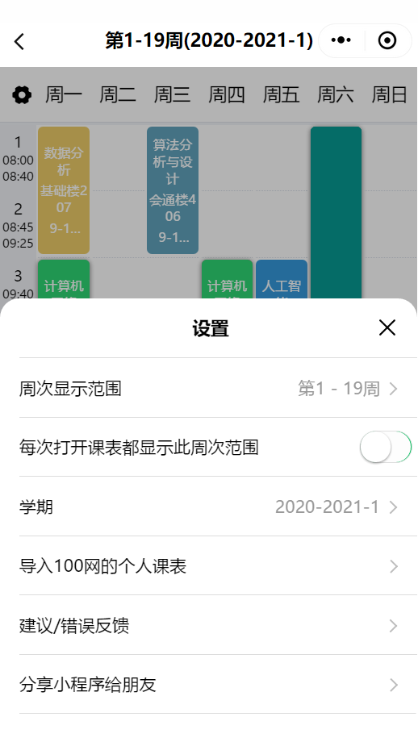
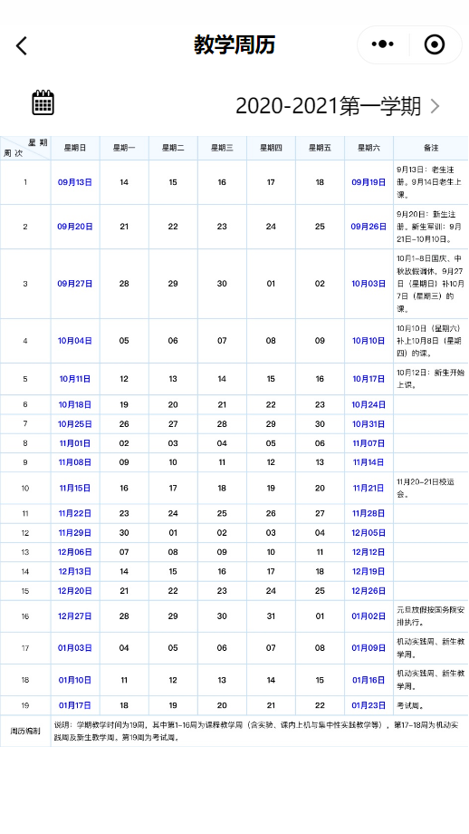
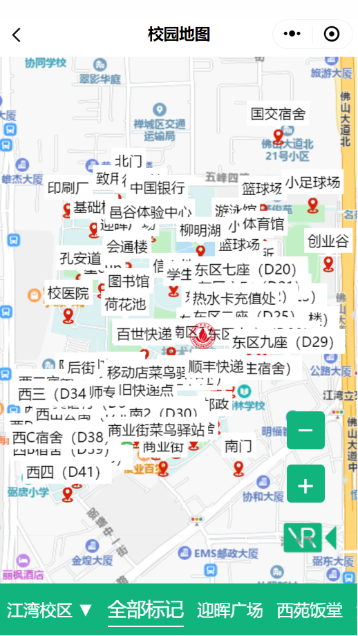
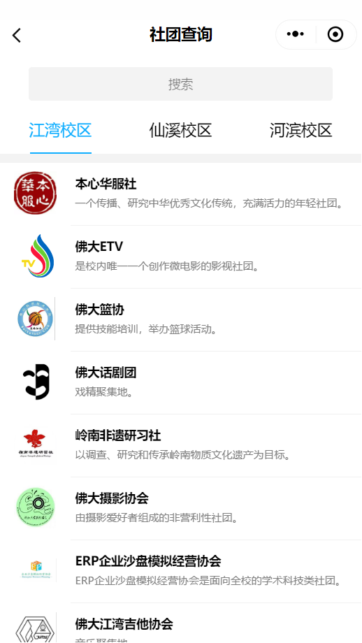
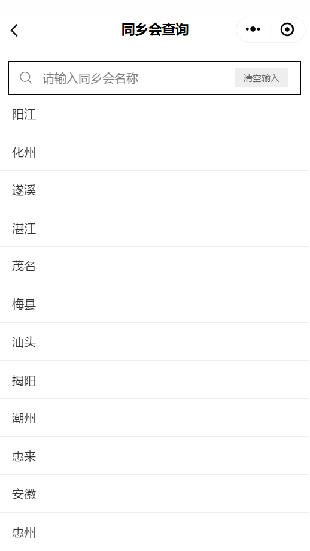
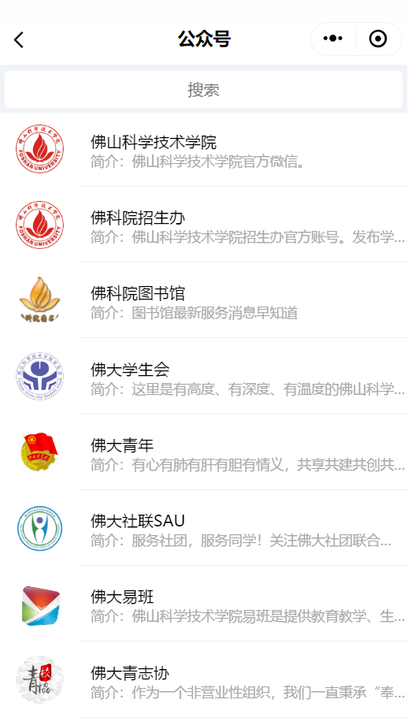
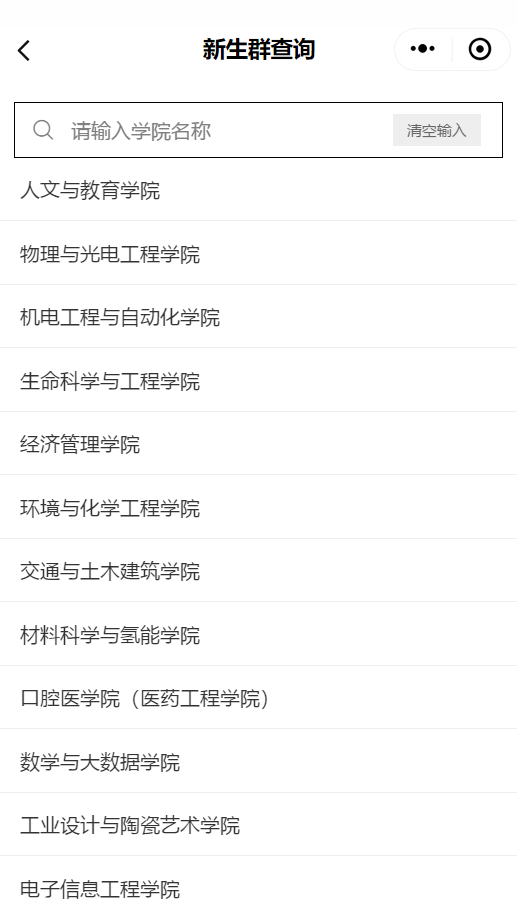

# iknow佛大

**关于iknow佛大**

> iknow佛大（原佛大新生小助手）由智慧佛大学生团队开发完成，是非官方的公益性的校园微信小程序。我们基于智慧校园的理念，为了帮助同学们更便捷地获取校园信息，从而开发出“iknow佛大”微信小程序。由于我们团队力量有限，iknow佛大只能提供少部分的校园服务，且小程序目前的功能还有很多可以优化的地方，欢迎反馈和建议，敬请期待后续更新。另外，欢迎同学们加入我们，与我们一起学习交流，邮箱联系fosuwxapp@163.com
>
> 该小程序基于微信小程序云开发，主要提供课程表、校园地图、教学周历、机构、社团、公众号、同乡会、宿舍、新生群...等等信息的查询服务。更多功能敬请期待。

**码云** https://gitee.com/fosuwxapp/iknow-fosu

**GitHub** https://github.com/MYvLiang/iknow-fosu

优先更新GitHub

## 首页

## 我的

## 课表

## 教学周历

## 校园地图

## 学校机构查询

## 学校社团查询

## 同乡会查询

## 公众号查询

## 新生群查询

